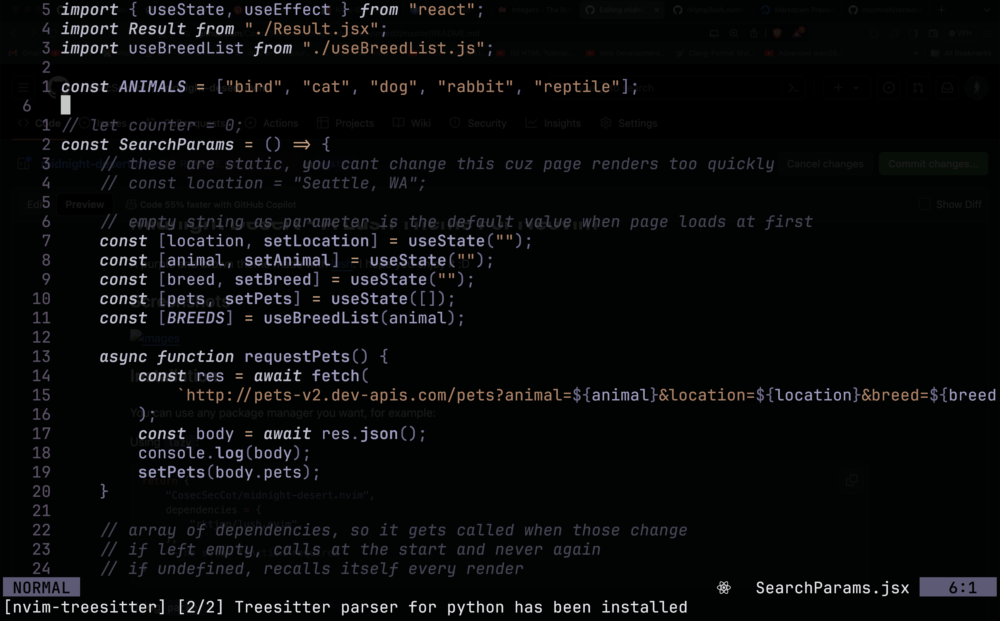

# Midnight Desert - A Lush Theme For Neovim

A purple and brown theme made with [lush](https://github.com/rktjmp/lush.nvim).
I hope you enjoy it :D

## Screenshots



## Installation

You can use any package manager you want, for example:

Using `lazy`:

``` lua
return {
    "CosecSecCot/midnight-desert.nvim",
    dependencies = {
        "rktjmp/lush.nvim",
    },
    -- no setup function required
}
```

Using `packer`:

``` lua
use {
    "CosecSecCot/midnight-desert.nvim",
    requires = "rktjmp/lush.nvim"
}
```

## Usage

To use this colorscheme simply type ```:colorscheme midnight-desert```

or add this code in your config file:

```vim
" Vimscript
colorscheme midnight-desert
```

or

```lua
-- Lua
vim.cmd [[colorscheme midnight-desert]]
```
